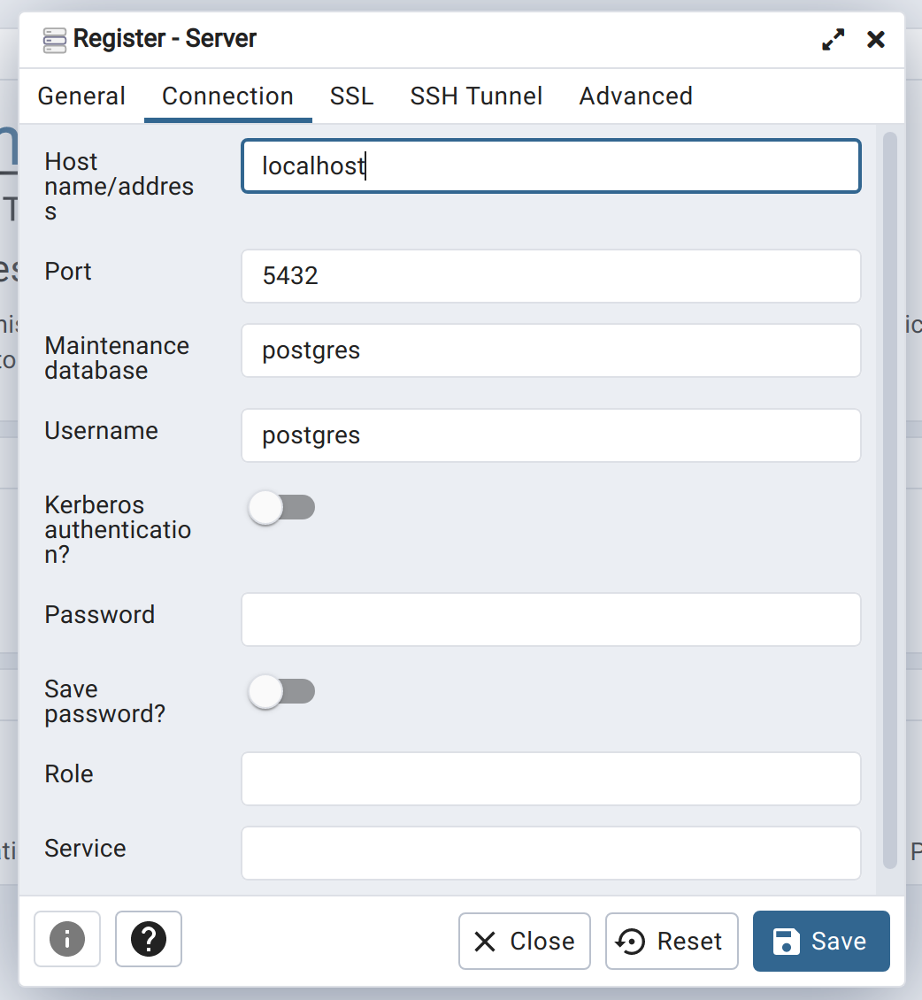
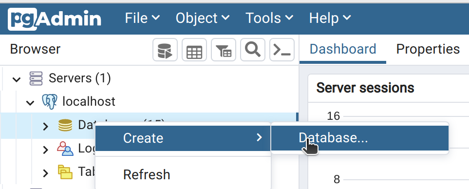
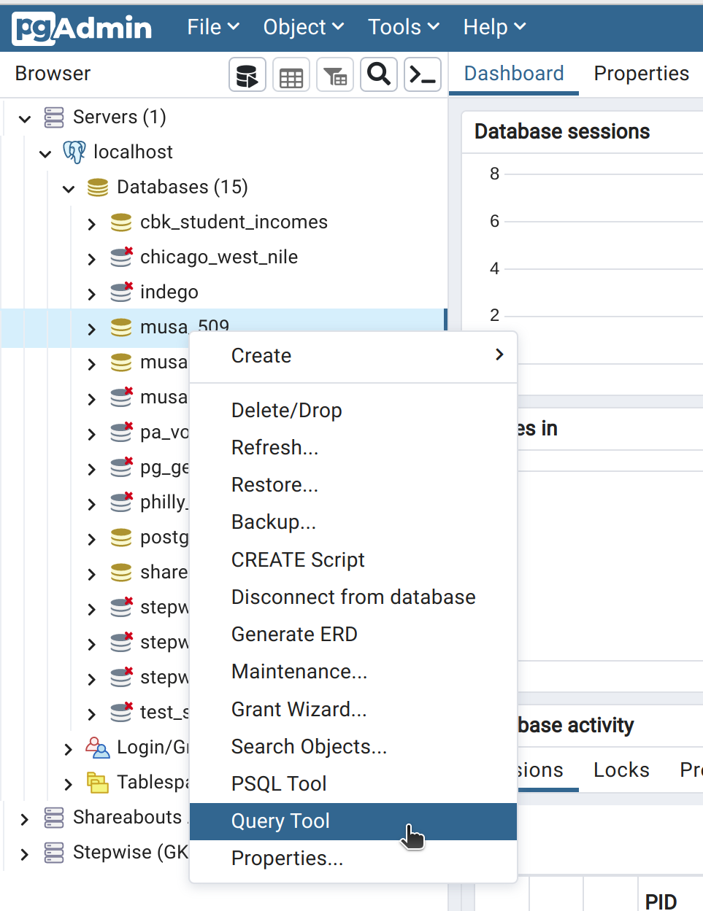
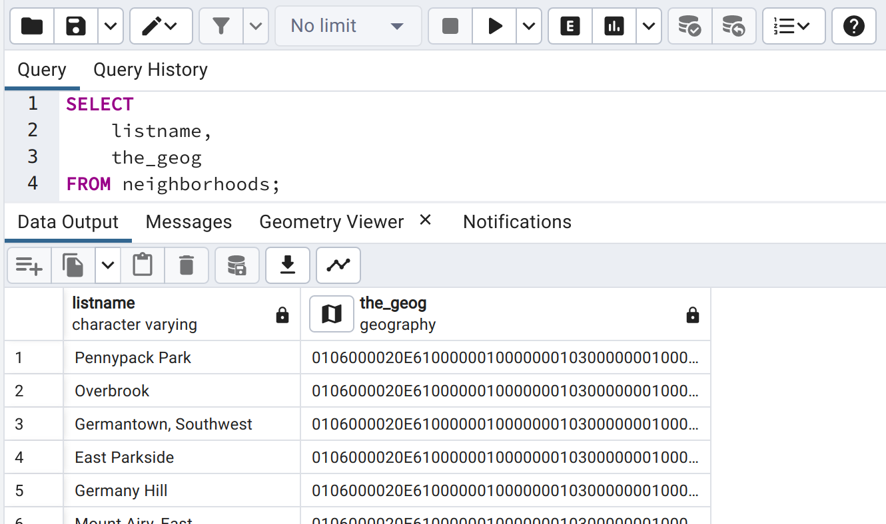

# Install PostgreSQL

You can find a set of installation instruction for your platform at https://www.postgresql.org/download/. Pay close attention to the port that you configure PostgreSQL to work on during installation -- `5432` is the default, but there are cases where that may not be the port used.

Make sure you install PostGIS along with PostgreSQL.

# Configure PGAdmin

To create a database you can use PGAdmin. First, register your local PostgreSQL server:


On the **General** tab, choose a name for the server as it will show up in the list on the left side of the window. Configure the **Connection** settings for how PGAdmin will connect to your database server. If you installed PostgreSQL correctly, then:
* The **host** will probably be `localhost`
* The **port** will probably be `5432`
* Leave the **maintenance database** as `postgres`
* The **username** and **password** will depend on what you set them to when you installed PostgreSQL.

You should be able to ignore the rest of the settings and click **Save**.



# Make sure it worked!

## 1. Create a new database in your PostgreSQL server.

Give the database some name (it doesn't matter what, as long as it's a valid SQL "identifier").


## 2. Enable PostGIS in the database.

You must do this once for each PostgreSQL database where you want to use geometric or geographic data types that come with PostGIS. Open a query editor for the database you just created:


In your query editor, enter the following SQL command and press the play (▶️) button.

```sql
CREATE EXTENSION postgis;
```

In the output you should see something like:

```
CREATE EXTENSION

Query returned successfully in 877 msec.
```

## 3. Load some data into your database.

Let's use the Philadelphia Neighborhoods dataset from Azavea to continue with our tests.

1.  Clone the https://github.com/azavea/geo-data repository to your computer.
2.  Open the folder for the repository in a terminal.
3.  Run the `ogr2ogr` tool (which should have been installed with PostGIS) using the command below, inserting your database connection information in the appropriate places:

    _For Mac/Linux:_
    ```sh
    ogr2ogr \
      -f "PostgreSQL" \
      -nln "neighborhoods" \
      -lco "OVERWRITE=yes" \
      -lco "GEOM_TYPE=geography" \
      -lco "GEOMETRY_NAME=the_geog" \
      PG:"host=localhost port=5432 dbname=... user=... password=..." \
      "Neighborhoods_Philadelphia/Neighborhoods_Philadelphia.geojson"
    ```

    _For Windows Powershell:_
    ```sh
    ogr2ogr `
      -f "PostgreSQL" `
      -nln "neighborhoods" `
      -lco "OVERWRITE=yes" `
      -lco "GEOM_TYPE=geography" `
      -lco "GEOMETRY_NAME=the_geog" `
      PG:"host=... port=... dbname=... user=... password=..." `
      "Neighborhoods_Philadelphia\\Neighborhoods_Philadelphia.geojson"
    ```

    For example, on my computer I ran:

    ```sh
    ogr2ogr \
      -f "PostgreSQL" \
      -nln "neighborhoods" \
      -lco "OVERWRITE=yes" \
      -lco "GEOM_TYPE=geography" \
      -lco "GEOMETRY_NAME=the_geog" \
      PG:"host=localhost port=5432 dbname=throwaway user=postgres password=postgres" \
      "Neighborhoods_Philadelphia/Neighborhoods_Philadelphia.geojson"
    ```

    If the command was successful you shouldn't see any output; you will just be returned to a new command prompt.

    The `ogr2ogr` command converts some spatial data from one format to another (in this case from GeoJSON to PostGIS). The `-f` value specifies the output format. The `-nln` value specifies the name of the table in the database. The `-lco` lines represent other options you can specify (such as the type of geometry and the name of the geometry field). The line that starts with `PG:` is for the output location, and the next line is for the input location.

    Next week we'll go over some other ways to load data into PostgreSQL.

## 4. Query the data.

Back in PG Admin open a new query editor and run the following SQL:

```sql
SELECT
    listname,
    the_geog
FROM neighborhoods;
```

If successful, you should see something like this:



Click on the map icon next to the header of the `the_geog` column. You should see a map that looks something like this:

