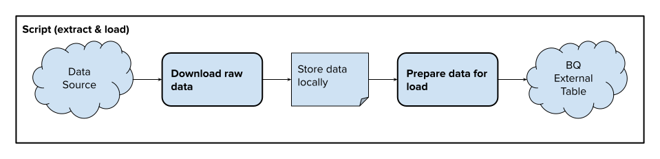
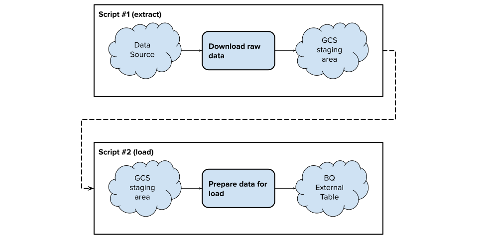

# Scripting Data Pipelines: Extracting with JavaScript/Python

---

## Agenda

- Extracting
  - Downloading data over HTTP
  - Working with geospatial file formats
  - Working with other file formats (like zip)

---

## Extracting

---

### Initialize a new folder for code:

<div class="columns-2">
<div>


```bash
mkdir -p ~/code/week06
cd ~/code/week06

python3 -m venv env
source env/bin/activate
```

</div>
<div>


```bash
mkdir -p ~/code/week06
cd ~/code/week06

npm init -y
```

</div>
</div>

> _**Python note**: I prefer to use `poetry` or `pipenv`, but just using `venv` directly is likely the most fool-proof._

---

### Download data (locally) with JavaScript

```javascript
import https from 'https';
import fs from 'fs';

const url = 'https://opendata-downloads.s3.amazonaws.com/opa_properties_public.csv';

https.get(url, (response) => {
  const f = fs.createWriteStream('opa_properties.csv');
  response.pipe(f);
});
```

---

### Download data (locally) with Python

```python
from urllib.request import urlopen

url = 'https://opendata-downloads.s3.amazonaws.com/opa_properties_public.csv'

with urlopen(url) as response:
    with open('opa_properties.csv', 'wb') as f:
        while chunk := response.read(1024 * 1024):
            f.write(chunk)
```

---

### Extract and load data as separate steps

Even though we can do both in one step, it's often useful to separate the two steps.

Instead of this:



---

### Extract and load data as separate steps

Do this:



