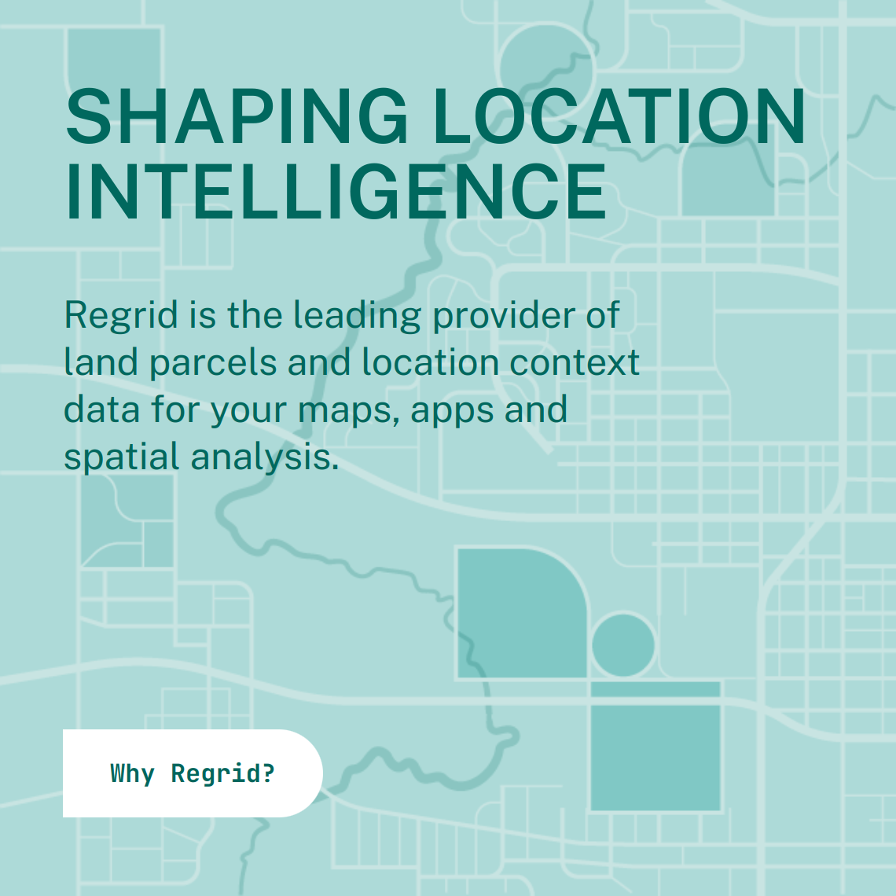

# Implementing ETL in Cloud Services

---

## Agenda

0.  Discuss the rest of the semester
1.  Review of extracting and (little-t) transforming files
2.  Loading into BigQuery (via Google Cloud Storage)
    * Service Accounts
    * Environment Variables
3.  Deploying to Google Cloud Platform (GCP)?
    * Cloud Functions
    * Cloud Scheduler
    * Workflows
4.  Estimating costs

---

# The rest of the semester!

---

## Guest Speakers

- Talk about their work and how they use data pipelines.
- **March 23: Matthew Klovski at [Regrid](https://regrid.com/)**
- **April 5: Laurie Merrell on the [Cal-ITP](https://www.calitp.org/) project.**

---

## In-class Project

<!-- We're going to do an end-to-end build of a municipal data product. -->

- **Property Taxes Platform**

  Property taxes are hard (from administrative and policy perspectives), and they're hard to understand (from the resident perspective).  We're going to build a platform that makes it easy for residents to track and compare their property valuations and taxes, and for city officials to keep their tax valuations up-to-date.

- We have the tools!

- Follow-alongs and in-class exercises.

---

## Your Final Projects

- Build a data product.
- Groups of up to 3 students.
- Presentations May 3 & 10.

---

# Review of extracting and (little-t) transforming files

Before Spring break we were:
* Downloading ("**Extracting**") data (census population count data and block group shape data, business license data, static GTFS feed data) from various file servers and APIs.
* Converting ("**transforming**") the data into a format that can be loaded into BigQuery (JSON-L, CSV, etc).

The code we wrote can be found at the [week07 tag of the pipeline01 repository](https://github.com/musa-509-spring-2023/pipeline01/tree/week07).

---

# What's next? Loading!

<!--

We've extracted and transformed our data, but we haven't loaded it into BigQuery yet.  We need to do that before we can start querying it. So we'll be loading our data into Google Cloud Storage (GCS) so that it can be used as the backing for external tables in BigQuery.

Let's mimic the way we did this in the previous week, but this time we'll be using the Google Cloud Storage (GCS) API to upload our files.

Previously, we had a folder named `raw_data/` where we extracted our initial files, and we had a folder named `processed_data/` where we stored our transformed files.  We'll be using GCS to store our files, so we'll need to create a bucket for each one of these concerns.

* Create a raw_data bucket
* Create a processed_data bucket
  (remember that bucket names need to be globally unique)
-->

---

<!--

* We'll start with the raw data bucket.  We'll call it `<prefix>_raw_data`.

-> Next

-->

---

<!--

* I often use us-east1 for projects dealing with Philadelphia, but I've started trying to use us-central1 for projects that are more general, or even when I'm just doing initial development.

-->

---

https://cloud.google.com/sustainability/region-carbon

<!--

* The reason is because of the Low-CO2 footprint of the data centers in Iowa. To be clear, I think focus on individualized CO2 footprints is a distraction, but I also do think it's important to be aware of the impact of our work.

-> Next

-->

---

<!--

As I mentioned at some point before, I'm a fan of this auto-class storage option, because it will automatically transition my data to a lower-cost storage option when it's not being accessed frequently.

-> Next

-->

---

<!--

For any buckets that I'm not planning on hosting a publicly facing static website from, I like to set "Enforce public access prevention". This means that any files that I upload to this bucket will be private by default, and I'll need to explicitly make them public if I want to share them. For public data sources this isn't a big deal, but if you might have a mix of public and private data, it's nice to have this option set.

-> Next

Particularly for raw data buckets, I like to set "Object versioning" to "Enabled". This means that if I accidentally delete a file, I can go back and restore it. This is a nice feature to have, but it does come at a cost, so I don't use it for all buckets. I use it for raw data buckets because I may not be able to go back and re-download the data if I accidentally delete it.

-->

---

<!--

-> Next

It'll always ask you to confirm that you want to create the bucket with public access prevention on. Just confirm your choice (unless it was actually a mistake).

-> Confirm

-->

---

---

<!--
* Now let's create a bucket for our processed data.  We'll call it `<prefix>_processed_data`.

-> Next

-->

---

<!--

This is going to be largely the same as we did for the raw data bucket, except object versioning is not as important for processed data, so we'll leave that off.

-->

---

<!--

* Now that we have our buckets, we can start uploading our files.  Let's start with the census data.

( GO TO THE CODE; work until an IAM error, then come back. )

-->

---

# Identity and Access Management (IAM)
(and Service Accounts)

---

## Create a service account

This service account will be responsible for doing all the things that need to be done in our data pipeline:

- Reading from and writing to GCS
- Reading from and writing to BigQuery
- Invoking Cloud Functions
- Invoking Workflows

---

...