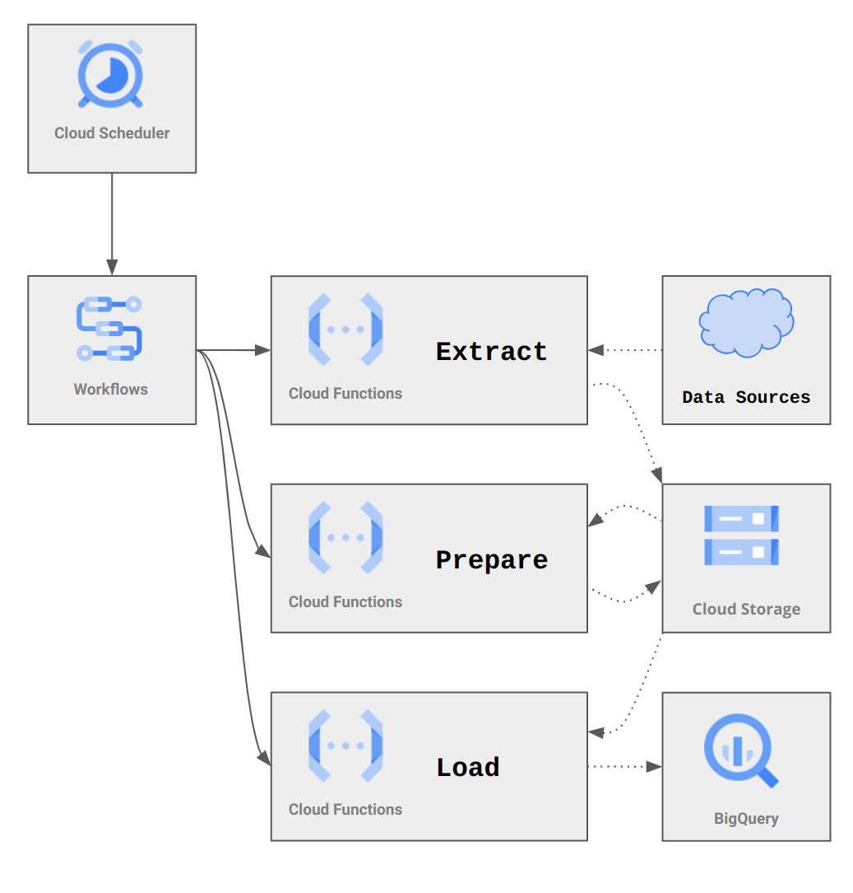
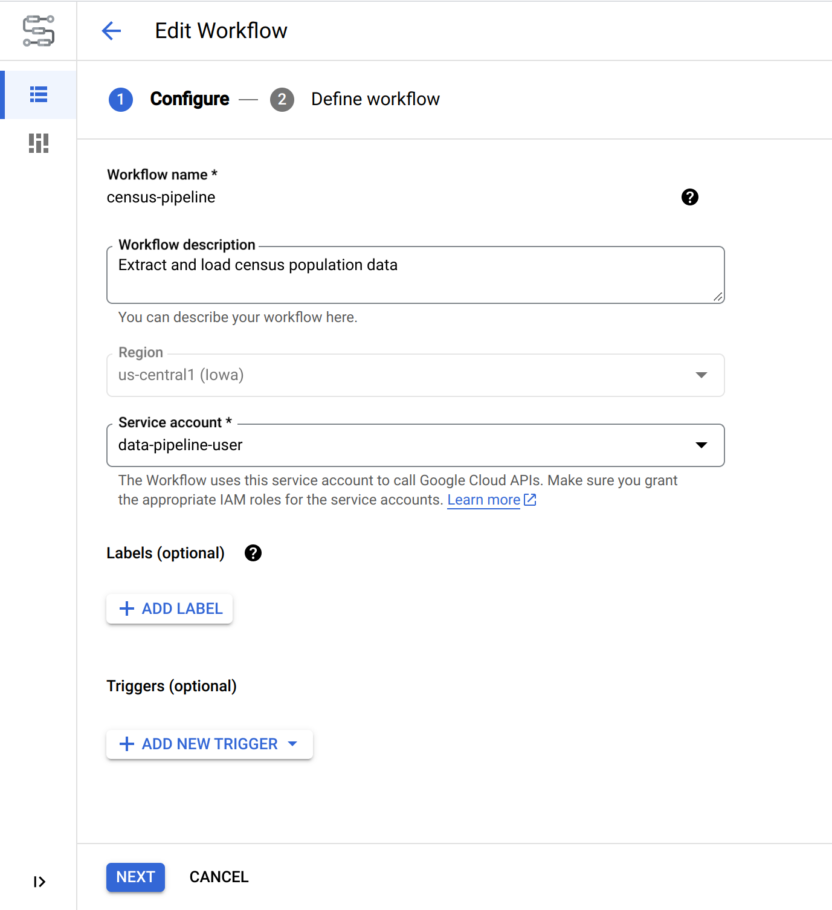
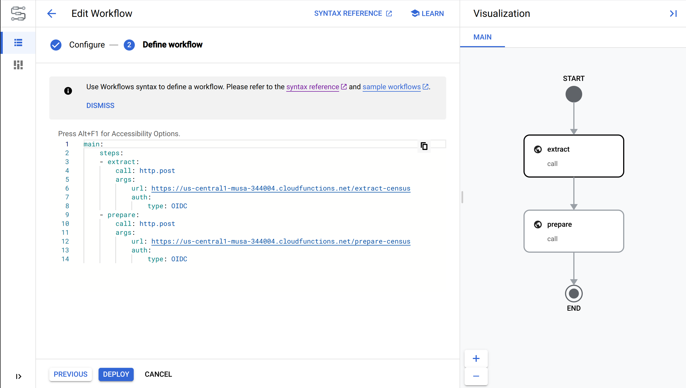

## Quick Git Tip:

- Do not store large files in your git repostories. Basically anything over 50MB should be stored in GCS or S3 or some other cloud file storage (which GitHub is not).

---

# Deploying to the Cloud

For a pipeline, you'll have to create a few types of resources in Google Cloud:
1.  The individual functions that will be run as part of the pipeline
2.  The workflow that will orchestrate the functions
3.  A scheduler job that will trigger the workflow

You'll also have to adjust the permissions for your service account so that it can access the resources it needs to.

---




---

## Install the `gcloud` command line tool

You can do everything we're going to do through the GUI (the Google Cloud Console), but most of it will be faster through the CLI. You can install the `gcloud` command line tool by following the instructions [here](https://cloud.google.com/sdk/docs/install-sdk). Follow those instructions at least through the _Initialize the gcloud CLI_ section.

---

# 0. Estimating the cost impact

- Google for "[Google Cloud Pricing Calculator](https://www.google.com/search?q=google+cloud+pricing+calculator)" and click on the first result.
- Keep an eye on your bill by creating a budget. See [the billing console](https://console.cloud.google.com/billing) for more information.

---

# 1. Creating the functions

---

## Convert script to Cloud Function package

Each step in your pipeline is going to be its own cloud function package (i.e. folder).

1. Create a new folder for the cloud function (e.g. `extract_census/` and `prepare_census/` will be different folders.)

<div class="columns-2">
<div>


2. Move your module (e.g. `extract_census.py`) into the new folder and rename it to `main.py`.
3. Copy your `requirements.txt` file into the new folder.

</div>
<div>


2. Move your module (e.g. `extract_census.mjs`) into the new folder and rename it to `index.mjs`.
3. Copy your `package.json` file into the new folder. In the `package.json` file, change the `main` property to `"index.mjs"`.
</div>
</div>

---

## Convert script to Cloud Function package

4.  Create a `.gcloudignore` file in the new folder and add the following lines to it:

    ```
    .gcloudignore
    .git
    .gitignore

    node_modules
    *.pyc
    ```

    See the [gcloudignore documentation](https://cloud.google.com/sdk/gcloud/reference/topic/gcloudignore) for more information on this file.

---

## Deploy the Cloud Function

5.  To deploy a cloud function, run the following command:

<!--
Note that there are two versions of cloud functions. Google is switching to second-generation Cloud Functions. Generally I'd recommend 2nd generation (as there are [some benefits](https://cloud.google.com/functions/docs/concepts/version-comparison#comparison-table)), but there are also some features of 1st-generation functions that aren't yet available for 2nd-generation (like an easier testing interface), so we'll use 1st-generation for now.
-->

<div class="columns-2">
<div>


```bash
gcloud functions deploy extract-census \
  --region us-central1 \
  --runtime python311 \
  --trigger-http \
  --source src/extract_census \
  --entry-point extract_data \
  --service-account <EMAIL>
```

</div>
<div>


```bash
gcloud functions deploy extract-census \
  --region us-central1 \
  --runtime nodejs18 \
  --trigger-http \
  --source src/extract_census \
  --entry-point extract_data \
  --service-account <EMAIL>
```

</div>
</div>

The options for `--runtime` are documented [here](https://cloud.google.com/functions/docs/concepts/exec#runtimes); I recommend the latest one for your language. The `--source` should be the package (folder) with your code. The `--entry-point` is the name of the function within your code. See the documentation for [`gcloud functions deploy`](https://cloud.google.com/sdk/gcloud/reference/functions/deploy) for more information.

---

## Test the Cloud Function

From the CLI, this is:

```bash
gcloud functions call extract-census
```

You can see your function at https://console.cloud.google.com/functions/list.

---

# 2. Orchestrate the pipeline with a Workflow

---



## Create a workflow

Start in the [Cloud Workflows](https://console.cloud.google.com/workflows) section of the Google Cloud Console.

<!-- It's helpful to have a visual of what's about to happen -->

---



<!-- Workflow definitions can be written either in JSON or in a format called YAML (which is a lot like JSON in essence, but with fewer syntactic elements (like curly brackets and the like); many people find it more readable than JSON. -->

---

## Workflow syntax

- See https://cloud.google.com/workflows/docs/reference/syntax
- We're primarily interested in the `http.post` call, which is part of the [Workflows standard library](https://cloud.google.com/workflows/docs/reference/stdlib/overview) of functionality.
- Because we didn't allow non-authenticated requests to our function, we'll need to provide some `auth`. In this case the authentication type will be [OpenID Connect (OIDC)](https://en.wikipedia.org/wiki/OpenID#OpenID_Connect_(OIDC)).

---

## Your Workflow as code

I highly recommend, after seeing that your workflow is structured correctly, that you **copy the JSON or YAML into a file in your project** (e.g. to a file named `census_pipeline.yml`). This will allow you to commit your workflow definition with the rest of your code, and will make it easier to deploy your workflow using the CLI if you hange it.

For example:
  
```bash
gcloud workflows deploy \
  census-pipeline \
  --source src/census_pipeline.yml \
  --location us-central1 \
  --service-account <EMAIL>
```

---

## Set up your service account

The service account you created for your pipeline is going to need to be able to do a few more things. So far it should already be able to read and write to a Google Cloud Storage bucket (because it has the [Storage Object Admin](https://cloud.google.com/storage/docs/access-control/iam-roles) role), but we'll need to add:
  - [Cloud Functions Invoker](https://cloud.google.com/functions/docs/reference/iam/roles#cloudfunctions.invoker), since we're asking the workflow to call a cloud function.

```bash
gcloud projects add-iam-policy-binding \
  <PROJECT_ID> \
  --member serviceAccount:<EMAIL> \
  --role roles/cloudfunctions.invoker
```

---

## Test your workflow

You can test your workflow by running the following command:

```bash
gcloud workflows execute census-pipeline
```

For more workflow-related commands, see https://cloud.google.com/sdk/gcloud/reference/workflows

---

# 3. Automate the pipeline with a Cloud Scheduler

---

## Pick a schedule

- We're going to create a scheduler job, but we have to tell it how frequently to run.
- We use a [cron expression](https://en.wikipedia.org/wiki/Cron) to specify the schedule. If you've heard of a "cron job", this is what it's referring to.
- The cron expression is a string of five fields, separated by spaces. The fields are:
  - `minute` (0-59)
  - `hour` (0-23)
  - `day of month` (1-31)
  - `month` (1-12)
  - `day of week` (0-6, where 0 is Sunday)
- [crontab.guru](https://crontab.guru/) is a great resource for figuring out your cron expression.

<!-- It's called crontab.guru because cron jobs are often scheduled in a file called a cron table (in other words, a crontab). -->

---

## Create a Cloud Scheduler job

```bash
gcloud scheduler jobs create http \
  census-pipeline-schedule \
  --location us-central1 \
  --schedule "0 9 * * 1-5" \  # 9:00 AM on Weekdays (Mon-Fri)
  --uri <WORKFLOW_URI> \
  --oauth-service-account-email <EMAIL>
```

The workflow URI can be found in the [Cloud Workflows](https://console.cloud.google.com/workflows) section of the Google Cloud Console, or you can construct it as: `https://workflowexecutions.googleapis.com/v1/projects/<PROJECT_ID>/locations/<LOCATION>/workflows/<WORKFLOW_NAME>/executions`

---

## Further empower your service account

The service account you created for your pipeline is going to need one more role:
  - [Workflows Invoker](https://cloud.google.com/workflows/docs/access-control#workflows.invoker), since we're asking the scheduler to start a workflow.

```bash
gcloud projects add-iam-policy-binding \
  <PROJECT_ID> \
  --member serviceAccount:<EMAIL> \
  --role roles/workflows.invoker
```

---

## Test your scheduler job

You can test your scheduler job by running the following command:

```bash
gcloud scheduler jobs run census-pipeline-schedule
```

For more scheduler-related commands, see https://cloud.google.com/sdk/gcloud/reference/scheduler

---

# Add another step to the pipeline

We have extracted and prepared the data, but not made it available in BigQuery. Let's add a step to the pipeline to do that.

---

## Create a BigQuery dataset

I'm going to call mine `source_data`.

---

## Create a new package folder

I'll call mine `load_census/`. Initialize the folder with a requirements.txt or package.json file.

---

## Construct a script that creates an external table

- Refer to the Google BigQuery [client library documentation](https://cloud.google.com/bigquery/docs/reference/libraries), and the documentation on the [`CREATE EXTERNAL TABLE` statement](https://cloud.google.com/bigquery/docs/reference/standard-sql/data-definition-language#create_external_table_statement).
- Add the [BigQuery Job User](https://cloud.google.com/bigquery/docs/access-control#bigquery.jobUser) role to your service account.
- Test your function locally with the `functions-framework` CLI, and then deploy it to Cloud Functions.

---

## Add the script to your workflow

- Add a new step to your workflow YAML file to call your new function.
- Re-deploy your workflow:
  ```bash
  gcloud workflows deploy \
    census-pipeline \
    --source src/census_pipeline.yml \
    --location us-central1 \
    --service-account <EMAIL>
  ```